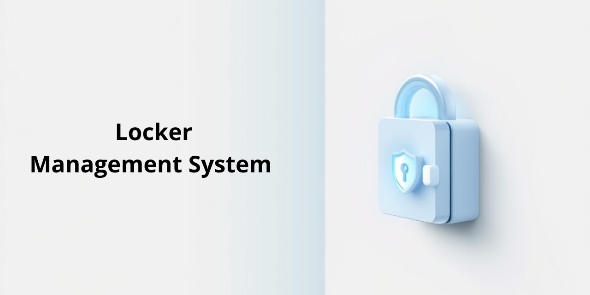

# 🛡️ Locker Management System

## 📖 Overview
The **Locker Management System** is a professional web-based solution designed to streamline the process of locker assignment and tracking. This project was developed with a dual focus: **User Experience (UX)** for seamless interaction and **Cybersecurity** for data integrity and protection.

---

## 🚀 Key Features
* **Smart Reservation:** A simplified interface for users to book and manage lockers.
* **Admin Control Panel:** A centralized dashboard for administrators to monitor locker availability and user logs.
* **Automated Email Alerts:** Real-time notifications for reservation confirmations and reminders using **MailKit**.
* **Responsive Design:** Fully optimized for desktops, tablets, and mobile devices.

---

## 🛡️ Cybersecurity Implementations
As a cybersecurity specialist, I implemented several layers of protection within this system:
* **Anti-SQL Injection:** Utilizing Parameterized Queries to prevent unauthorized database access.
* **Secure Authentication:** Robust login logic to ensure user data privacy.
* **Input Sanitization:** Strict validation on all user inputs to mitigate XSS (Cross-Site Scripting) risks.
* **Secure Communication:** Integration of secure SMTP protocols for automated notifications.

---

## 🛠️ Tech Stack & Tools

  
  
  
  
  

* **Backend:** C# / ASP.NET Web Forms.
* **Frontend:** HTML5, CSS3, JavaScript, Bootstrap 3.3.7.
* **Libraries:** MailKit (v3.4.1) for Email automation.
* **Database:** Microsoft SQL Server.

---

## 🎨 Design Philosophy
This project reflects a minimalist and clean aesthetic. I chose a **light-colored palette** (Off-white & Tech Blue) to create a professional environment that reduces cognitive load for the user while maintaining a modern, high-tech feel.

---

## 📸 Screenshots
*(Add your system screenshots here to showcase your design skills)*
| Login Page | Admin Dashboard |
|------------|-----------------|
|  |  |

---

## 👩‍💻 About the Developer
**Hussah Al-Musaib**
* 🛡️ Cybersecurity Specialist | 💻 Web Developer | 🎨 Visual Designer
* [GitHub Profile](https://github.com/Hussa-Almusayab)
* [LinkedIn Profile](https://www.linkedin.com/in/Hussa-Almusayab)

---
*Developed with ❤️ and a focus on security.*
